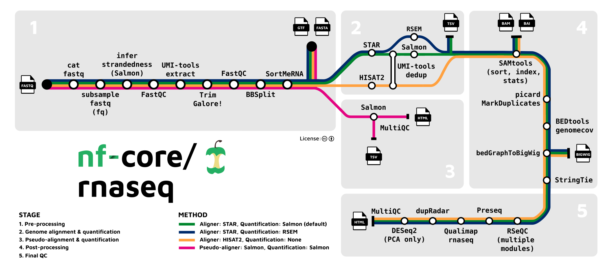

#  

[](https://nf-co.re/rnaseq/results)[](https://doi.org/10.5281/zenodo.1400710)

[](https://www.nextflow.io/)
[](https://docs.conda.io/en/latest/)
[](https://www.docker.com/)
[](https://sylabs.io/docs/)
[](https://tower.nf/launch?pipeline=https://github.com/nf-core/rnaseq)

[](https://nfcore.slack.com/channels/rnaseq)[](https://twitter.com/nf_core)[](https://www.youtube.com/c/nf-core)

## Introduction

**nf-core/rnaseq** is a bioinformatics pipeline that can be used to analyse RNA sequencing data obtained from organisms with a reference genome and annotation. It takes a samplesheet and FASTQ files as input, performs quality control (QC), trimming and (pseudo-)alignment, and produces a gene expression matrix and extensive QC report.



1. Merge re-sequenced FastQ files ([`cat`](http://www.linfo.org/cat.html))
2. Sub-sample FastQ files and auto-infer strandedness ([`fq`](https://github.com/stjude-rust-labs/fq), [`Salmon`](https://combine-lab.github.io/salmon/))
3. Read QC ([`FastQC`](https://www.bioinformatics.babraham.ac.uk/projects/fastqc/))
4. UMI extraction ([`UMI-tools`](https://github.com/CGATOxford/UMI-tools))
5. Adapter and quality trimming ([`Trim Galore!`](https://www.bioinformatics.babraham.ac.uk/projects/trim_galore/))
6. Removal of genome contaminants ([`BBSplit`](http://seqanswers.com/forums/showthread.php?t=41288))
7. Removal of ribosomal RNA ([`SortMeRNA`](https://github.com/biocore/sortmerna))
8. Choice of multiple alignment and quantification routes:
   1. [`STAR`](https://github.com/alexdobin/STAR) -> [`Salmon`](https://combine-lab.github.io/salmon/)
   2. [`STAR`](https://github.com/alexdobin/STAR) -> [`RSEM`](https://github.com/deweylab/RSEM)
   3. [`HiSAT2`](https://ccb.jhu.edu/software/hisat2/index.shtml) -> **NO QUANTIFICATION**
9. Sort and index alignments ([`SAMtools`](https://sourceforge.net/projects/samtools/files/samtools/))
10. UMI-based deduplication ([`UMI-tools`](https://github.com/CGATOxford/UMI-tools))
11. Duplicate read marking ([`picard MarkDuplicates`](https://broadinstitute.github.io/picard/))
12. Transcript assembly and quantification ([`StringTie`](https://ccb.jhu.edu/software/stringtie/))
13. Create bigWig coverage files ([`BEDTools`](https://github.com/arq5x/bedtools2/), [`bedGraphToBigWig`](http://hgdownload.soe.ucsc.edu/admin/exe/))
14. Extensive quality control:
    1. [`RSeQC`](http://rseqc.sourceforge.net/)
    2. [`Qualimap`](http://qualimap.bioinfo.cipf.es/)
    3. [`dupRadar`](https://bioconductor.org/packages/release/bioc/html/dupRadar.html)
    4. [`Preseq`](http://smithlabresearch.org/software/preseq/)
    5. [`DESeq2`](https://bioconductor.org/packages/release/bioc/html/DESeq2.html)
15. Pseudo-alignment and quantification ([`Salmon`](https://combine-lab.github.io/salmon/); _optional_)
16. Present QC for raw read, alignment, gene biotype, sample similarity, and strand-specificity checks ([`MultiQC`](http://multiqc.info/), [`R`](https://www.r-project.org/))

Some pre-configured genomes and annotations.
You can also update your own to aws and enter the aws path in the power UI.

```
selected genome assembly and annotations:
      // UCSC hg38 analysis set, ncbi refseq version 110
      'ucsc_hg38_analysis_refseq_v110' {
        fasta = 's3://dicerna-genomes/ucsc_hg38_analysis_refseq_v110/hg38.analysisSet.fa.gz'
        gtf  = 's3://dicerna-genomes/ucsc_hg38_analysis_refseq_v110/hg38.ncbiRefSeq.gtf.gz'
 
      }
      // added this by Zhe, requested by Chris, https://www.ncbi.nlm.nih.gov/assembly/GCF_012559485.2/
      'Macaca_fascicularis_MFA1912RKSv2_ERCC92_refseq_v102' {
        fasta = 's3://dicerna-genomes/Macaca_fascicularis_MFA1912RKSv2_ERCC92_refseq_v102/GCF_012559485.2_MFA1912RKSv2_genomic_ERCC92.fna.gz'
        gtf  = 's3://dicerna-genomes/Macaca_fascicularis_MFA1912RKSv2_ERCC92_refseq_v102/GCF_012559485.2_MFA1912RKSv2_genomic_ERCC92_fixed.gtf.gz'
      }
      
      // rn7 from ucsc. to be consistent, may download the current version to our s3 bucket.
      'rn7_ucsc_refseq' {
        fasta = 'ftp://hgdownload.soe.ucsc.edu/goldenPath/rn7/bigZips/rn7.fa.gz'
        gtf  = 'ftp://hgdownload.soe.ucsc.edu/goldenPath/rn7/bigZips/genes/ncbiRefSeq.gtf.gz'
      }
      'mf5_ucsc_refseq' {
        fasta = 'ftp://hgdownload.cse.ucsc.edu/goldenPath/macFas5/bigZips/macFas5.fa.gz'
        gtf  = 'ftp://hgdownload.cse.ucsc.edu/goldenPath/macFas5/bigZips/genes/macFas5.ncbiRefSeq.gtf.gz'
      }
      'mf5_ucsc_ensGene' {
        fasta = 'ftp://hgdownload.cse.ucsc.edu/goldenPath/macFas5/bigZips/macFas5.fa.gz'
        gtf  = 'ftp://hgdownload.cse.ucsc.edu/goldenPath/macFas5/bigZips/genes/macFas5.ensGene.gtf.gz'
      }
      'hg38_ensGene' {
       fasta = 's3://dicerna-genomes/hg38_ncbiRefSeq/hg38.fa.gz'
       gtf  = 's3://dicerna-genomes/hg38_ncbiRefSeq/hg38.ensGene.gtf.gz'
      }
      'hg38_refseq' {
       fasta = 's3://dicerna-genomes/hg38_ncbiRefSeq/hg38.fa.gz'
       gtf  = 's3://dicerna-genomes/hg38_ncbiRefSeq/hg38.ncbiRefSeq.gtf.gz'
      }
      
      // download from https://hgdownload.soe.ucsc.edu/goldenPath/hg38/bigZips/
      'mm39_refseq' {
       fasta = 's3://dicerna-genomes/mm39_ucsc/mm39.fa.gz'
       gtf  = 's3://dicerna-genomes/mm39_ucsc/mm39.ncbiRefSeq.gtf.gz'
      }
      
      'human_ensembl_v104_2021_March' {
        fasta = 's3://dicerna-genomes/human_ensembl_v014_2021_March/Homo_sapiens.GRCh38.dna.primary_assembly.fa.gz'
        gtf  = 's3://dicerna-genomes/human_ensembl_v014_2021_March/Homo_sapiens.GRCh38.104.gtf.gz'
      }

      // removed gene line
      //  zcat GCF_000001405.39_GRCh38.p13_genomic.gtf.gz | awk '$3 != "gene" ' | gzip > GCF_000001405.39_GRCh38.p13_genomic.fixed.gtf.gz
      'human_refseq_release_109_2021_May' {
        fasta = 's3://dicerna-genomes/refseq_GRCh38_major_release_seqs_for_alignment_pipelines/GCA_000001405.15_GRCh38_full_analysis_set.fna.gz'
        gff  = 's3://dicerna-genomes/refseq_GRCh38_major_release_seqs_for_alignment_pipelines/GCA_000001405.15_GRCh38_full_analysis_set.refseq_annotation.gff.gz'
        hisat2_index = 's3://dicerna-genomes/refseq_GRCh38_major_release_seqs_for_alignment_pipelines/GCA_000001405.15_GRCh38_full_analysis_set.fna.hisat2_index.tar.gz'
      }
      'GRCm38_v102' {
        fasta = 's3://dicerna-genomes/GRCm38/Mus_musculus.GRCm38.dna.primary_assembly.fa.gz'
        gtf  = 's3://dicerna-genomes/GRCm38/Mus_musculus.GRCm38.102.gtf'
      }
      'GRCm39_v104' {
        fasta = 's3://dicerna-genomes/GRCm39_v104/Mus_musculus.GRCm39.dna.primary_assembly.fa.gz'
        gtf  = 's3://dicerna-genomes/GRCm39_v104/Mus_musculus.GRCm39.104.gtf.gz'
      }
      'mf6_ens_v104' {
        fasta = 's3://dicerna-genomes/Macaca_fascicularis_6.0/Macaca_fascicularis.Macaca_fascicularis_6.0.dna.toplevel.fa.gz'
        gtf = 's3://dicerna-genomes/Macaca_fascicularis_6.0/Macaca_fascicularis.Macaca_fascicularis_6.0.104.gtf.gz'
      }
      'mf5_ens_v102' {
        fasta = 's3://dicerna-genomes/Macaca_fascicularis_5.0_ensembl_release_102/Macaca_fascicularis.Macaca_fascicularis_5.0.dna.toplevel.fa.gz'
        gtf = 's3://dicerna-genomes/Macaca_fascicularis_5.0_ensembl_release_102/Macaca_fascicularis.Macaca_fascicularis_5.0.102.gtf.gz'
      }
      'mf5_ens_v102_ga01' {
        fasta = 's3://dicerna-genomes/Macaca_fascicularis_5.0_ensembl_release_102/Macaca_fascicularis.Macaca_fascicularis_5.0.dna.toplevel.fa.gz'
        hisat2_index = 's3://dicerna-genomes/Macaca_fascicularis_5.0_ensembl_release_102/feiran_hisat2_index/'
        splicesites = 's3://dicerna-genomes/mf5_ensembl_ga01/Macaca_fascicularis.ensembl.5.0.96_splicesites.txt'
        gtf = 's3://dicerna-genomes/Macaca_fascicularis_5.0_ensembl_release_102/Macaca_fascicularis.Macaca_fascicularis_5.0.102.gtf.gz'
      }
      'mf5_refseq_r101' {
        fasta = 's3://dicerna-genomes/Macaca_fascicularis_5.0_refseq_release_101/GCF_000364345.1_Macaca_fascicularis_5.0_genomic.fna.gz'
        gtf  = 's3://dicerna-genomes/Macaca_fascicularis_5.0_refseq_release_101/GCF_000364345.1_Macaca_fascicularis_5.0_genomic.fixed.gtf.gz'
      }
```


> **Note**
> The SRA download functionality has been removed from the pipeline (`>=3.2`) and ported to an independent workflow called [nf-core/fetchngs](https://nf-co.re/fetchngs). You can provide `--nf_core_pipeline rnaseq` when running nf-core/fetchngs to download and auto-create a samplesheet containing publicly available samples that can be accepted directly as input by this pipeline.

> **Warning**
> Quantification isn't performed if using `--aligner hisat2` due to the lack of an appropriate option to calculate accurate expression estimates from HISAT2 derived genomic alignments. However, you can use this route if you have a preference for the alignment, QC and other types of downstream analysis compatible with the output of HISAT2.

## Usage

> **Note**
> If you are new to nextflow and nf-core, please refer to [this page](https://nf-co.re/docs/usage/installation) on how to set-up nextflow. Make sure to [test your setup](https://nf-co.re/docs/usage/introduction#how-to-run-a-pipeline) with `-profile test` before running the workflow on actual data.

First, you need to prepare a samplesheet with your input data that looks as follows:

**samplesheet.csv**:

```csv
sample,fastq_1,fastq_2,strandedness
CONTROL_REP1,AEG588A1_S1_L002_R1_001.fastq.gz,AEG588A1_S1_L002_R2_001.fastq.gz,auto
CONTROL_REP1,AEG588A1_S1_L003_R1_001.fastq.gz,AEG588A1_S1_L003_R2_001.fastq.gz,auto
CONTROL_REP1,AEG588A1_S1_L004_R1_001.fastq.gz,AEG588A1_S1_L004_R2_001.fastq.gz,auto
```

Each row represents a fastq file (single-end) or a pair of fastq files (paired end). Rows with the same sample identifier are considered technical replicates and merged automatically. The strandedness refers to the library preparation and will be automatically inferred if set to `auto`.

> **Warning**
> Please provide pipeline parameters via the CLI or Nextflow `-params-file` option. Custom config files including those provided by the `-c` Nextflow option can be used to provide any configuration **except for parameters**; see [docs](https://nf-co.re/usage/configuration#custom-configuration-files).

Now, you can run the pipeline using:

```bash
nextflow run nf-core/rnaseq \
    --input samplesheet.csv \
    --outdir <OUTDIR> \
    --genome GRCh37 \
    -profile <docker/singularity/.../institute>
```

For more details, please refer to the [usage documentation](https://nf-co.re/rnaseq/usage) and the [parameter documentation](https://nf-co.re/rnaseq/parameters).

## Pipeline output

The output of the pipeline applied to a [full-sized example dataset](https://github.com/nf-core/test-datasets/tree/rnaseq#full-test-dataset-origin) can be found [here](https://nf-co.re/rnaseq/results).
For more details, please refer to the [output documentation](https://nf-co.re/rnaseq/output).

## Online videos

A short talk about the history, current status and functionality on offer in this pipeline was given by Harshil Patel ([@drpatelh](https://github.com/drpatelh)) on [8th February 2022](https://nf-co.re/events/2022/bytesize-32-nf-core-rnaseq) as part of the nf-core/bytesize series.

You can find numerous talks on the [nf-core events page](https://nf-co.re/events) from various topics including writing pipelines/modules in Nextflow DSL2, using nf-core tooling, running nf-core pipelines as well as more generic content like contributing to Github. Please check them out!

## Credits

These scripts were originally written for use at the [National Genomics Infrastructure](https://ngisweden.scilifelab.se), part of [SciLifeLab](http://www.scilifelab.se/) in Stockholm, Sweden, by Phil Ewels ([@ewels](https://github.com/ewels)) and Rickard Hammarén ([@Hammarn](https://github.com/Hammarn)).

The pipeline was re-written in Nextflow DSL2 and is primarily maintained by Harshil Patel ([@drpatelh](https://github.com/drpatelh)) from [Seqera Labs, Spain](https://seqera.io/).

The pipeline workflow diagram was designed by Sarah Guinchard ([@G-Sarah](https://github.com/G-Sarah)) and James Fellows Yates ([@jfy133](https://github.com/jfy133)).

Many thanks to other who have helped out along the way too, including (but not limited to):

- [Alex Peltzer](https://github.com/apeltzer)
- [Colin Davenport](https://github.com/colindaven)
- [Denis Moreno](https://github.com/Galithil)
- [Edumnd Miller](https://github.com/Emiller88)
- [Gregor Sturm](https://github.com/grst)
- [Jacki Buros Novik](https://github.com/jburos)
- [Lorena Pantano](https://github.com/lpantano)
- [Matthias Zepper](https://github.com/MatthiasZepper)
- [Maxime Garcia](https://github.com/maxulysse)
- [Olga Botvinnik](https://github.com/olgabot)
- [@orzechoj](https://github.com/orzechoj)
- [Paolo Di Tommaso](https://github.com/pditommaso)
- [Rob Syme](https://github.com/robsyme)

## Contributions and Support

If you would like to contribute to this pipeline, please see the [contributing guidelines](.github/CONTRIBUTING.md).

For further information or help, don't hesitate to get in touch on the [Slack `#rnaseq` channel](https://nfcore.slack.com/channels/rnaseq) (you can join with [this invite](https://nf-co.re/join/slack)).

## Citations

If you use nf-core/rnaseq for your analysis, please cite it using the following doi: [10.5281/zenodo.1400710](https://doi.org/10.5281/zenodo.1400710)

An extensive list of references for the tools used by the pipeline can be found in the [`CITATIONS.md`](CITATIONS.md) file.

You can cite the `nf-core` publication as follows:

> **The nf-core framework for community-curated bioinformatics pipelines.**
>
> Philip Ewels, Alexander Peltzer, Sven Fillinger, Harshil Patel, Johannes Alneberg, Andreas Wilm, Maxime Ulysse Garcia, Paolo Di Tommaso & Sven Nahnsen.
>
> _Nat Biotechnol._ 2020 Feb 13. doi: [10.1038/s41587-020-0439-x](https://dx.doi.org/10.1038/s41587-020-0439-x).
